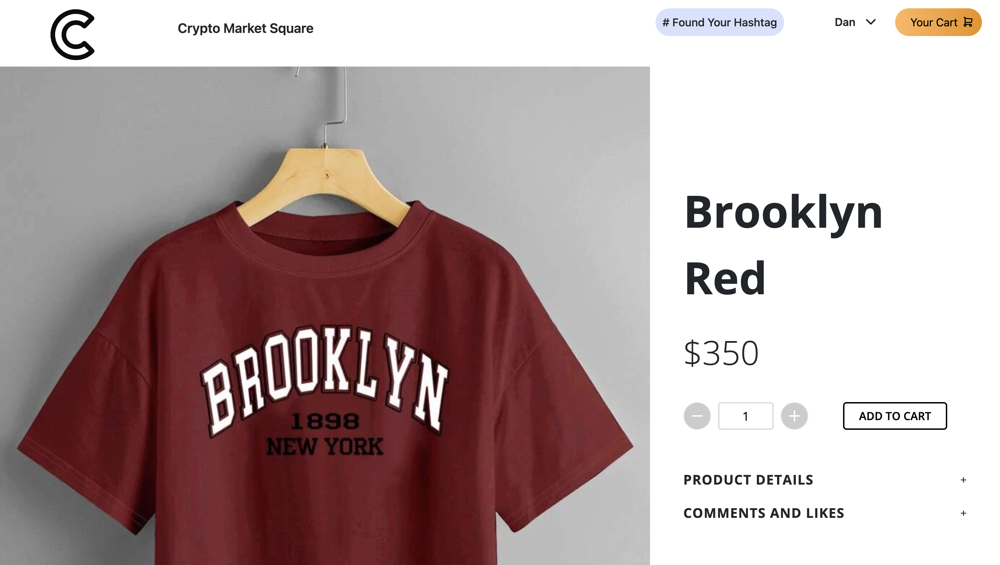
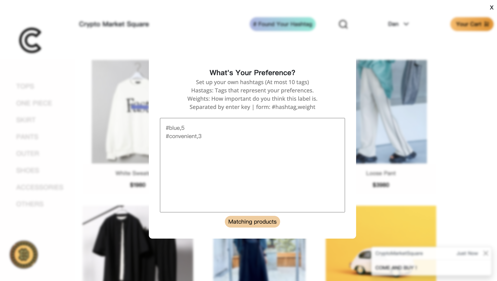
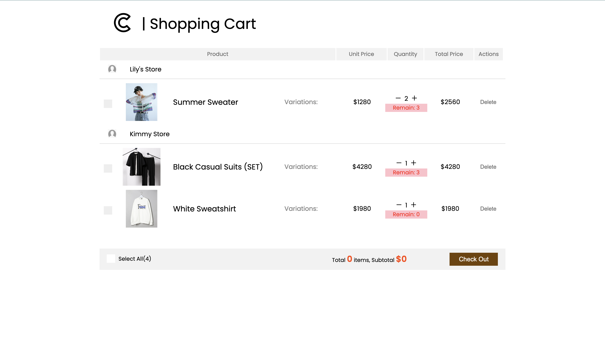
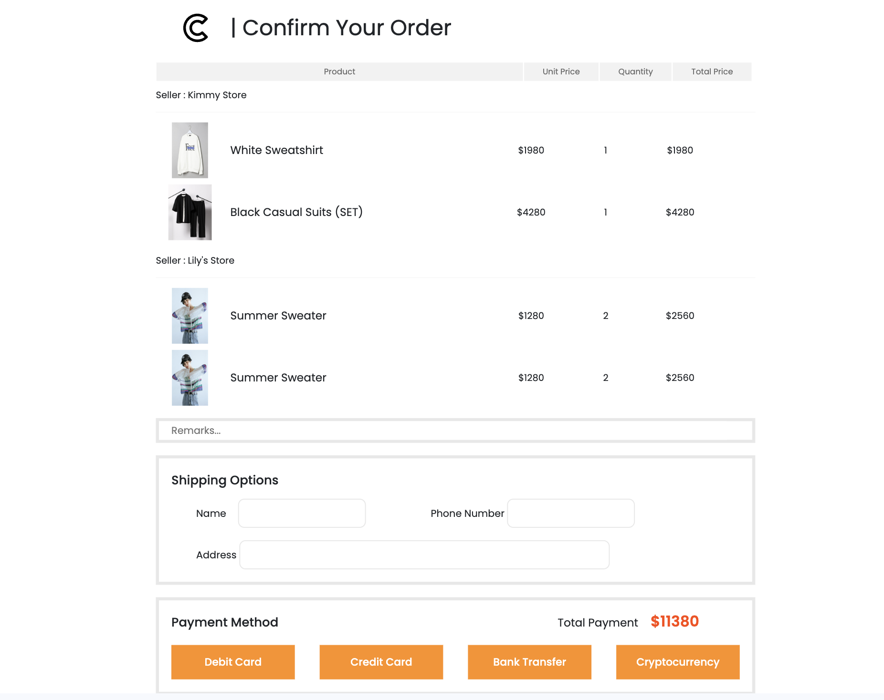
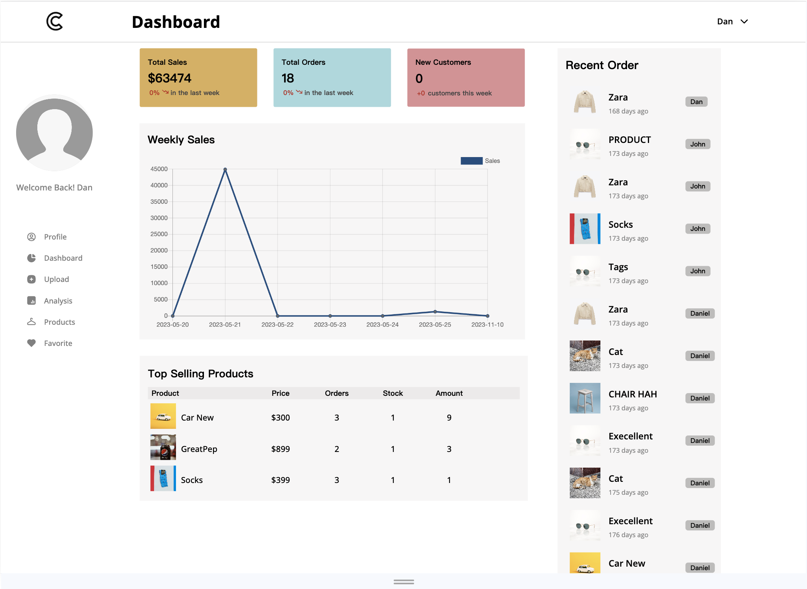
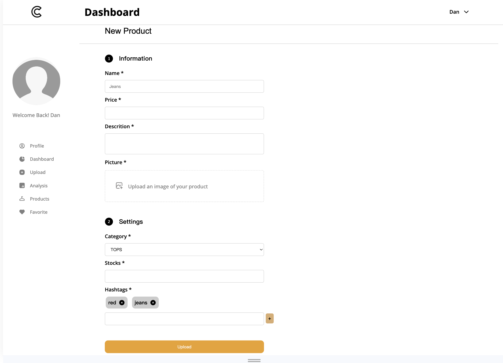
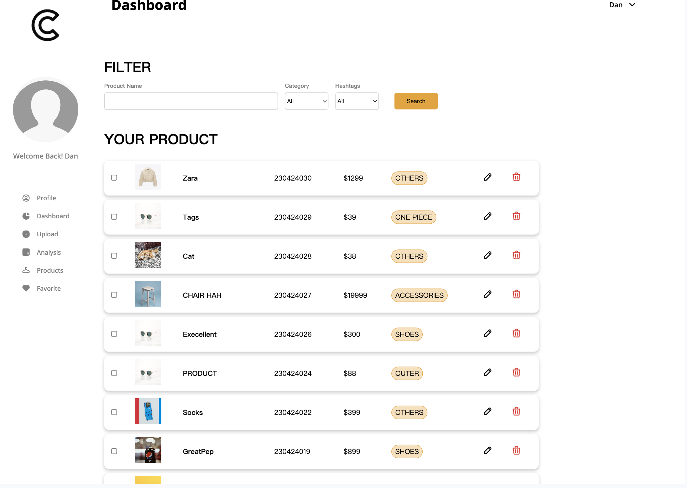
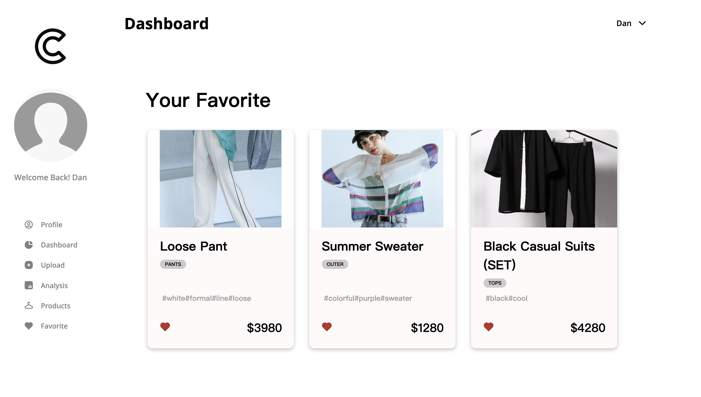

# Crypto Market Square

## Description
This crypto marketplace project combines HTML, CSS, JavaScript, PHP, and MySQL to offer users a platform where they can seamlessly buy or sell clothing items. The interactive dashboard not only facilitates transactions but also empowers users with insightful sales data analysis. Behind the scenes, a sophisticated recommendation system enhances the user experience, providing personalized suggestions based on their preferences and purchase history.

## Features 
- Buy Clothes
- Sell Clothes
- Dashboard for data analysis (for seller)
- Recommendation System (Collbarative filtering)

## Technologies Used
- HTML5
- CSS3 (SCSS)
- Javascript (Jquery)
- PHP
- MySQL

## Contributing 
- Kimmy Yo
- 魏宇民 
- 洪紹軒

## Copyright 
- Photo credited are from the Internet Clothing Shops (Zara, dotstTW, etc.)
- Credit belongs to the owners
- Products Page design references to  <a href="https://www.veja-store.com/en_eu/c/women">VEJA</a>

## Products Browsing Page

- selecting products based on different categories (with breadcrumbs)

## Product Details Page 

- interactive + buttons allowing more likes and products details 

## Custom Product Finding 
1. Found Your Hashtag 

2. Add to cart 

3. Payment 

## Dashboard 
1. Seller main dashboard

2. Upload section 

3. My Product section 

4. Favorite section 

## Crypto 
1. Daily Checkin with Earning Crypto Money 

